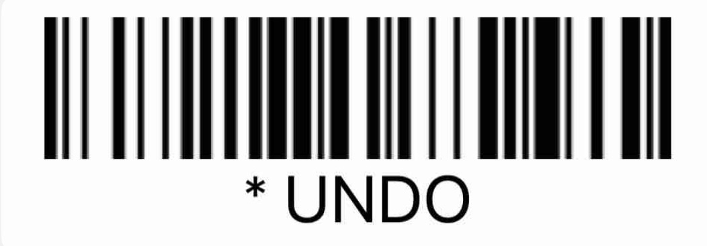
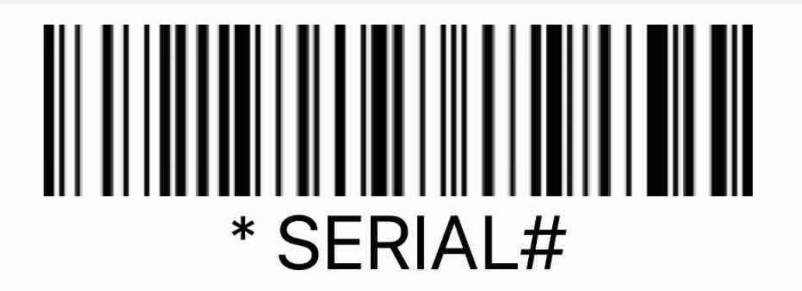

# Barcode Scanner Commands

A quick AHK v2 script for making macros that execute based off a scanned barcode that doesn't require any VBA or Excel macros. Just download Autohotkey v2 from Company Portal to be able to run.

The script detects if Excel is open and then waits for a certain combination of keys (* followed by an Enter within 300ms) before running a quick script to detect which command was scanned by reading the cell above.

## Built-in commands

### Undo

Barcode:
	

Usage: Scanning this barcode with the script running and Excel open will undo the cell above (aka the previous scan).

### Serial Number

Barcode:
	

Usage: Scanning this barcode with the script running and Excel open will bring you up one cell and to the right, which should be the Serial Number column. After pressing Enter it will realign you with the Asset Tag column.

## Documentation

[AHK v2 Documentation](https://www.autohotkey.com/docs/v2/)

### Making a custom command
**1)** Make a barcode that starts with an asterisks followed by a space and then a command name, for example a command called test is:
    
       * TEST

**2)** Enter the below command as an else if statement in the code block below "**ENTER COMMAND NAMES FOR SCANNING HERE**" which is on line 34. The command should follow the below structure:

		} else if(A_Clipboard ~= "XXX") {
			goto YYY

Where XXX is the command name as written on the barcode (so * TEST would just be "TEST") and YYY is the name of the command to go to in the code (See Step 3). A functioning example of this would look like this:

		} else if(A_Clipboard ~= "UNDO") {
			goto ScanUndo

**3)** Enter what the command will do (refer to [AHK documentation](https://www.autohotkey.com/docs/v2/) for help) as a goto function below **ENTER FUNCTIONS HERE FOR SCANNING**. This will be called when Step 2 is ran and should start with what YYY was. Here is an example of the undo script:

    ScanUndo:
	    Send "{Delete}{Up}{Delete}"
	    scanActive := false
	    return

**4)** After entering the correct code, print the barcode and rerun the script to update it. Then after scanning the barcode with Excel open the code should execute.

**Debug:** In order to see how the code executes and whether your specific macro was triggered, click the AHK icon in the system tray (shown below) and select *Open* to see what lines were ran. 
